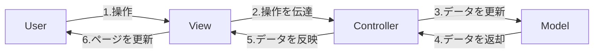

---
# try also 'default' to start simple
theme: seriph
# random image from a curated Unsplash collection by Anthony
# like them? see https://unsplash.com/collections/94734566/slidev
background: https://source.unsplash.com/collection/94734566/1920x1080
titleTemplate: "React研修資料 - ②"
exportFilename: "React研修資料 - ②"
# apply any windi css classes to the current slide
class: "text-center"
# https://sli.dev/custom/highlighters.html
highlighter: prism
# show line numbers in code blocks
lineNumbers: false
# persist drawings in exports and build
drawings:
  persist: true
# use UnoCSS
css: unocss
---

# React 研修資料 ②

<div class="pt-12">
  <span @click="$slidev.nav.next" class="px-2 py-1 rounded cursor-pointer" hover="bg-white bg-opacity-10">
    Press Space for next page <carbon:arrow-right class="inline"/>
  </span>
</div>

---

# 目次

環境構築~React の基礎

1. Vite を使って環境構築
1. JSX とは
1. なぜ React は JSX を使用するのか
1. JSX を書いてみよう
1. リンターとフォーマッタ
1. React 概論
1. コンポーネントの基本

---

# 1.1 Vite を使って環境構築

Vite を使って環境構築

React を使えるようにするためには、コンパイラ[^1]やら minify[^2] するためのバンドラやらが必要になります。<br>
それらを一手に担うのが <span>[Vite]('https://ja.vitejs.dev/')</span> です。

今回は Vite を使用して、React の環境構築を進めていきます。それにあたり、下記のソフトウェアがインストールされているか確認してください。

1. Node.js[^3]
2. yarn[^4]
<div class="h-7"></div>

[^1]: ある言語のコードを他の言語に変換すること ([詳細は MDN へ]('https://developer.mozilla.org/ja/docs/Glossary/Compile'))
[^2]: コードにある余計な空白を取り除いたりして、サイズを小さくすること ([詳細は MDN へ]('https://developer.mozilla.org/ja/docs/Glossary/minification'))
[^3]: JavaScript をサーバーサイドで実行するためのソフトウェア ([公式サイトへ]('https://nodejs.org/ja/'))
[^4]: npm と同様、パッケージマネージャーの 1 種。ちなみに筆者は pnpm を使用している。 ([公式サイトへ]('https://yarnpkg.com/'))

---

# 1.2 Vite を使って環境構築

Vite を使って環境構築

vite で環境構築をする手順

1. `yarn create vite`コマンドを入力します。質問が表示されますので、回答しながらプロジェクトの雛形を作成します。
2. 雛形が作成できたら、作成したプロジェクトのディレクトリまで移動して、必要なパッケージをインストールします。
3. インストールできたら、`yarn dev`と打ってみましょう。Vite と React のロゴが出てくれば OK です。

---

# 1.3 ソースコードを編集してみよう！

Vite を使って環境構築

1. まずは自由にディレクトリ構造を見てみましょう。
2. `index.html`を見てみる
3. `index.html`で読み込まれている `main.jsx`ファイルを見てみる
4. `App.jsx`を見てみる
5. `http://localhost:5173/src/App.jsx`にアクセスする
6. `App.jsx`を編集する => `Hello, World!`と表示してみよう！

---

# 1.4 ディレクトリ/ファイル構造

Vite を使って環境構築

| ディレクトリ名/ファイル名 | 内容                                                       |
| ------------------------- | ---------------------------------------------------------- |
| src/                      | アプリケーションのソースコードを書く                       |
| node_modules/             | アプリケーションに必要な npm パッケージが置いてある        |
| public/                   | 公開用のアセットファイルを置く                             |
| package.json              | インストールしたパッケージの情報などが書かれた設定ファイル |
| yarn.lock                 | インストールしたパッケージの依存情報が保存されたファイル   |
| vite.config.js            | Vite の設定ファイル                                        |
| .gitignore                | Git リポジトリに含めないリスト                             |

---

# 2.1 JSX とは

JSX とは

なぜ JSX というのか...「JavaScript Syntax Extension」とも「JavaScript XML」とも言われる

=> JSX は JavaScript の中に XML ライクな記述ができるようにした<span class="font-bold text-xl"> 拡張構文 </span>のこと(JSX は JavaScript の枠組みを超えるものではない)

JSX で記述された React のコードはどのようにコンパイルされるのか？

<div class="grid grid-cols-2 gap-5">

<div>
```jsx
{/* コンパイル前 */}
<button type="submit" autoFocus>
  Click Here!
</button>
```
</div>

<div>

```js
// コンパイル後
import { jsx as _jsx } from "react/jsx-runtime";

_jsx("button", {
	type: "sbumit",
	autoFocus: true,
	children: "Click here!",
});
```

</div>
</div>

コンパイル後は Vanilla JavaScript に変換される

---

# 2.2 JSX をコンパイルする

JSX とは

JSX は Babel や tsc などのコンパイラによってコードの変換が行われます。

ここでは実際に Babel を使用してコンパイルを体験してみましょう。

```jsx
<button type="submit" autoFocus>
	Click Here!
</button>
```

[このページに](https://babeljs.io/repl#?browsers=defaults%2C%20not%20ie%2011%2C%20not%20ie_mob%2011&build=&builtIns=false&corejs=3.21&spec=false&loose=false&code_lz=Q&debug=false&forceAllTransforms=false&shippedProposals=false&circleciRepo=&evaluate=false&fileSize=false&timeTravel=false&sourceType=module&lineWrap=true&presets=env%2Creact&prettier=false&targets=&version=7.20.4&externalPlugins=&assumptions=%7B%7D)上記のコードをコピペして確認してみましょう。

---

# 2.3 JSX のコンパイラオプション ①

JSX とは

JSX のコンパイルはコンパイラオプションの設定によって出力結果が変わる。

| 設定値       | 入力      | 出力                                        | 出力ファイルの拡張子 |
| ------------ | --------- | ------------------------------------------- | -------------------- |
| preserve     | `<div />` | `<div />`                                   | .jsx                 |
| react        | `<div />` | `React.createElement("div")`                | .js                  |
| react-native | `<div />` | `<div />`                                   | .js                  |
| react-jsx    | `<div />` | `_jsx("div", {}, void 0);`                  | .js                  |
| react-jsxdev | `<div />` | `_jsx("div", {}, void, false, {...}, this)` | .js                  |

---

# 2.3 JSX のコンパイラオプション ②

JSX とは

最初に紹介したコンパイル結果は`react-jsx`でコンパイルした結果です。<br>これは、2020 年 10 月にリリースされた React 17.0 で導入された比較的新しい変換形式です。<br>以前のコンパイラオプションのデフォルトは`react`で下記のような出力結果でした。

```jsx
React.createElement(
	"button",
	{ type: "submit", autoFocus: true },
	"Click here!"
);
```

これからは都合がいいので従来の変換形式の方で JSX についての説明を進めていきます。

---

# 2.4 JSX のコンパイル結果

JSX とは

先のコードを実行した結果の返り値は下記のようになります。

```jsx
{
  type: 'button'.
  props: {
    type: 'submit',
    autoFocus: true,
    children: 'Click here!'
  },
  key: null
}
```

これは JavaScript（または TypeScript）において、`React.createElement`というインターフェースを介した結果、得ることのできるオブジェクトです。
つまり、React における JSX の構文というのは、本質的には`React.createElement`のシンタックスシュガー（糖衣構文）であり、`ReactElement`オブジェクトを生成する特殊な式だと言えます。<br>
JSX は JavaScript の枠組みを超えるような特別なシステムではありません。だからこそ、`HTML`ライクな構文と一緒に JavaScript を書くことができるのです。

---

# 2.x JSX は React だけのもの？

コラム

これまで勉強してきた JSX という拡張構文は React のみで使用できるものでしょうか？

実は React 以外でも JSX 記法は使えます。例えば Vue.js。

Vue.js も JSX で書くことができ、<a href="https://jp.vuejs.org/v2/guide/render-function.html" target="_blank">公式ドキュメント</a>でも JSX での書き方を紹介しています。

こうしてさまざまな FW で JSX を使用できるのも、JSX が JavaScript の枠組みを超えるものではないから実現できることなのです。

---

# 3.1 なぜ React は JSX を使用するのか

<div>
ここまで説明してきた通り、React では JSX 記法を使用してコードを記述していきます。<br>
ですが JavaScript の FW の中には JSX をメインに使用せずにコードを記述していくものも多くあります。

例）<span class="text-red-600">Angular, Vue.js, Ember, Lit, Svelte</span> など

上記の FW たちをまとめて<span class="text-red-600">「HTML テンプレート派」</span>としましょう。<br>実際にこれらの FW 達は、React のように JavaScript の枠組みの中でマークアップをするのではなく、独自の記法（Vue.js だったら `v-if`など）を使用してマークアップをしていきます。

これらの<span class="text-red-600">「HTML テンプレート派」</span>の FW に対して React のような JavaScript の枠組みの中でコードを記述する FW を<span class="text-yellow-400">「JS ファースト派」</span>とします。

それでは一体<span class="text-red-600">「HTML テンプレート派」</span>と<span class="text-yellow-400">「JS ファースト派」</span>の違いはなんでしょうか？

</div>

---

# 3.2 HTML テンプレート vs JS ファースト ①

なぜ React は JSX を使用するのか

<span class="text-red-600">「HTML テンプレート派」</span>と<span class="text-yellow-400">「JS ファースト派」</span>の違いは

### アプリケーションをどう捉えているか

だと考えます。

<div class="grid grid-cols-2">
<div class="text-center">
<div class="text-red-600">「HTML テンプレート派」の考え</div>

Web アプリケーション=<span class="font-bold text-xl">【動的な Web ページ】</span>

=> 最終的な出力結果が HTML であることを期待する

</div>
<div class="text-center">
<div class="text-yellow-400">「JS ファースト派」の考え</div>

Web アプリケーション=<span class="font-bold text-xl"><br>【プラットフォームがブラウザのアプリケーション】</span>

=> 最終的な出力結果が HTML である必要はない<br>
(ただプラットフォームがブラウザであるだけ。プラットフォームが変わればネイティブアプリもデスクトップアプリも開発できる。)

</div>
</div>

---

# 3.2 HTML テンプレート vs JS ファースト ②

なぜ React は JSX を使用するのか

「HTML テンプレート派」と「JS ファースト」、両者の違いを「Web アプリケーションをどう考えているか」という観点から違いを考えてみました。<br>
さらにその視点から、「組版指定」[^1]と「制御構造」の主従関係へと発展させてみましょう。

<div class="grid grid-cols-2 gap-5">
<div class="text-center">
<div class="text-red-600">HTML テンプレート派</div>
<div class="flex gap-5 justify-center"><span>主: 組版指定</span> 従: 制御構造</div>

- 必然的に HTML の中に独自構文を埋め込むことになる
- 簡単なアプリケーションならワークするが、制御構造が主体の複雑なアプリケーションになったときに色々なところに無理が出てくる
- 本格的にアプリケーションを開発しようとすると多くのことを覚えることになる

</div>
<div class="text-center">
<div class="text-yellow-400">JS ファースト派</div>
<div class="flex gap-5 justify-center"><span>主: 制御構造</span> 従: 組版指定</div>

- 制御構造の枠組みの中で UI を実現していくことになる
- Vanilla JavaScript と変わらない開発体験で、本質を捉えれば覚えることは少ない（その分 JS の知識は必要）

</div>
</div>

[^1]: ここでは UI を表現するためのマークアップのこと

---

# 3.3 JS ファーストのメリット

なぜ React は JSX を使用するのか

- ロジックとデザインを混在して記述できる（のちに MVC アーキテクチャと比較してみます）
- 上記のメリットに伴って、コンポーネントを分割しやすい

  機能によってコンポーネントを分割しやすく、リファクタリングしやすい

- JSX が純粋な式なので、静的解析や型推論に適している

  関数型プログラミングと相まって、コンポーネントごとにテストを行いやすい

- エラーの原因を特定しやすい

  JavaScript で開発を行うので、エラーメッセージも Vanilla JS と同じようにエラーの原因が特定しやすい。

---

# 4.1 JSX の書き方

<div>
これまで JSX とは何か、そして JSX で記述することで得られる恩恵を学んできました。

このセクションでは実際に JSX を書いてみて、その書き方を学びましょう。

Vite で環境構築したプロジェクトをもとに説明していきます。

</div>

---

# 4.2 JSX の基本 ①

JSX の書き方

<div class="flex justify-center">

</div>

---

# 4.2 JSX の基本 ②

JSX の書き方

1. 自身が式である JSX はその中に別の式を埋め込める

```jsx
const patty = "Patty";
const greet = (name) => <p>Hello, {name || "Guest"}</p>;
.......
<div>{greet(patty)}</div>;
```

`{}`の中に式を埋め込むことで、その式が評価される => `if`や`for`は記述できない

2. JSX の中で任意の条件でレンダリングする結果を動的に変更したいときは「ショートサーキット評価」を使用する

```jsx
const n = Math.floor(Math.random() * 10); // 0~9のランダムな整数を生成
......
{n > 5 && (<p>{n}は5よりも大きい値です</p>)}
{n > 5 || (<p>{n}は5以下の値です</p>)}
<p>{n}は{n % 2 === 0 ? "偶数" : "奇数" }です</p>

```

---

# 4.2 JSX の基本 ③

JSX の書き方

3. 繰り返し処理

```jsx
const list = ["Patty", "Rolley", "Bobby"];
return (
	<ul>
		{list.map((name) => (
			<li>Hello, {name}!</li>
		))}
	</ul>
);
```

値を返す式なので`.filter(...).map(...)`のようにメソッドチェーンや演算子を用いてさらに高度な表現も可能

---

# 4.2 JSX の基本 ④

JSX の書き方

4. コメント

```jsx
<div>
	{
		// インラインコメント
	}
	{/*
    複数行に
    わたるコメント
  */}
</div>
```

---

# 4.2 JSX の基本 ⑤

JSX の書き方

5. React.Fragment

これはエラーになる

```jsx
const element = (
  <div>foo</div>
  <div>bar</div>
  <div>baz</div>
)
```

トップレベルに複数の要素を置くことはできない。必ずトップレベルは一つの要素でないといけない

<div class="grid grid-cols-2 gap-5">
<div>

```jsx
const element = (
  <div>
    <div>foo</div>
		<div>bar</div>
    <div>baz</div>
  </div>
```

</div >

<div>

```jsx
const element = (
  <> {/* もしくは <React.Fragment></React.Fragment>*/}
    <div>foo</div>
		<div>bar</div>
    <div>baz</div>
  </>
```

</div>
</div>

---

# 4.3 JSX とコンポーネントの関係

JSX の書き方

JSX から ReactElement へと変換される流れのおさらい

```jsx
<MyComponent foo="bar">baz</MyComponent>

⏬

React.createElement('MyComponent', {foo: 'bar'}, 'baz');

⏬

{
  type: 'MyComponent',
  props: {
    foo: 'bar',
    children: 'baz'
  },
  key: null
}
```

---

# 4.4 コンポーネントを書いてみる

JSX の書き方

<div  class="grid grid-cols-2 gap-5">
<div class="text-center">
呼び出す側

```jsx
import { MyComponent } from "src/components/MyComponents";

<MyComponent foo="bar">baz</MyComponent>;
```

</div>
<div class="text-center">
呼び出される側

```jsx
// src/components/MyComponents

export const MyComponents = (props) => {
	const { foo, children } = props;
	return (
		<div>
			{foo} + {children}
		</div>
	); // <div>bar + baz</div> とレンダリングされる
};
```

</div>
</div>

---

# 4.5 props でデータの受け渡しをする ①

JSX の書き方

```jsx
<Greet name="Patty" times={4} /> // name, times が props
```

React において`props`というのは、コンポーネントを関数を考えた時に「引数」にあたるものと考えることができます。

```jsx
// Greet コンポーネントの定義
export const Greet = (props) => {
	const { name, times = 1 } = props;

	return (
		<>
			[...Array(times)].map(() => (<p>Hello, {name}!</p>
			))
		</>
	);
};
```

---

# 4.5 props でデータの受け渡しをする ②

JSX の書き方

`props`の受け取りに直接分割代入も使えます。

```jsx
// Greet コンポーネントの定義
export const Greet = ({ name, times }) => {
	return (
		<>
			[...Array(times)].map(() => (<p>Hello, {name}!</p>
			))
		</>
	);
};
```

この方がシンプルですし、`props`から渡ってくるデータがわかりやすいのでこちらの記述を使用すること多いです。

---

# 4.6 JSX で入れ子になった子要素を渡す

JSX の書き方

<div class="grid grid-cols-2 gap-2">


</div>

レンダリング結果

```html
<details>
	<summary>Greet</summary>
	<p>Hello World!!</p>
	<p>Good Bye!!</p>
</details>
```

---

# 4.7 JSX で論理属性を渡す

JSX の書き方

<div class="grid grid-cols-2 gap-5">


<div>

`props`はデフォルトでは`false`だが左のように書くことで`true`を渡すことができる。

※もちろん下記のようにも渡せる

```jsx
<Summary title="Greet" folded={true}>
```

</div>
</div>

---

# 5.1 リンター・フォーマッタの設定

<div>
リンターとは... => 静的に構文を解析してくれるツール

コードフォーマッタとは... => 記述したコードを整形してくれるツール

このセクションでは、広く普及してる`ESlint`(リンター)と`Prettier`(フォーマッタ)の説明をします。

これらのツールの環境構築は結構面倒で、よくありがちなのがジョインしたチームでずっと使われている設定を継ぎ足し、継ぎ足し...と設定が肥大化して、どんな設定がしてあるのかわからなくなるパターン。

このような状況にならないために、このセクションを通して自分で 1 から環境構築ができるようにします。

</div>

---

# 6.1 React 概論

### そもそも FW（フレームワーク）とは

「Web アプリケーションやシステムを開発するために必要な機能があらかじめ用意された枠組み」のこと<br>
有名な FW だと、`Vue.js`,`Laravel`,`SpringBoot`,`Django`などがある<br>
=> `JavaScript`,`PHP`,`Java`,`Python`を使用する際により効率的に開発をするために使用される

### React はライブラリなのか

React はライブラリ

1. そもそも公式がライブラリと言っている
2. ちゃんとしたアプリケーションを開発するとなるとエコシステム周りの勉強がかなり必要 => React だけでは開発ができない。

=> React を取り巻くエコシステムの勉強が必要 => React の思想を知らないと必ずどこかで詰まる

---

# 6.2 React のコンセプト

React 概論

[React](https://reactjs.org)の公式サイトを振り返る（本資料作成時点で v18.2.0）

- Declarative （宣言的）
- Component-Based （コンポーネントベース）
- Learn Once, Write Anywhere （ひとたび習得すれば、あらゆるプラットフォームで開発できる）

<div class="mt-3">

#### v0.3.0（React ができた当初のコンセプト）

- Declarative （宣言的）
- Efficient （効率的）
- Flexible (柔軟)
</div>
<div class="mt-3">

#### v0.5.1（React v0.3.0 が出た同年 12 月のコンセプト）

- Just The UI (提供するのは UI のみ)
- Virtual DOM （仮想 DOM）
- Data Flow (データフロー)
</div>

---

# 6.3 React を読み解く 6 つのキーワード

React 概論

歴代トップページに記載されてきたコンセプトをまとめると以下の 6 つ

1. Declarative (宣言的)
1. Component-Based (コンポーネントベース)
1. Just The UI (提供するのは UI のみ)
1. Virtual DOM (仮想 DOM)
1. One-Way DataFlow (単方向データフロー)
1. Learn Once, Write Anywhere (ひとたび習得すれば、あらゆるプラットフォームで開発できる)

---

# 6.4 Declarative

React 概論

React では ReactElement を JSX を用いて宣言的（どんなデータを表示されるべきか）にフォーカスして開発できる

👉 宣言型プログラミング <=> 命令型プログラミング

### UI を宣言的に開発できるのは DX の向上に大きく貢献する

<div class="mt-5">

# 6.5 Component-Based と Just The UI

React 概論

### Component-Based

コンポーネントベースのアーキテクチャ

👉 機能単位でデザインとロジックがカプセル化されたコンポーネントを組み合わせてアプリケーションを作成する設計思想

</div>

---

# 6.5 Component-Based 続き

React 概論

<div class="mt-5">
<div>
<span class="text-2xl font-bold">MVC</span>

分離するもの：<span class="text-red-500">技術的な役割</span>



</div>
<div class="mt-10">
<span class="text-2xl font-bold">Component-Based</span>

分離するもの：<span class="text-red-500">機能</span>

ロジックやデータの更新・表示を機能ごとに行う

👉 同じページ内でも非同期的にデータの更新・表示ができる

</div>
</div>

---

# 6.6 Just The UI

React 概論

### Just The UI（提供するのは UI だけ）≠ フルスタックのフレームワーク

<div class="mt-5">

- <a href="https://ja.reactjs.org/" target="_blank">公式ドキュメント</a>でも React は UI ライブラリだと自称している。

  > A JavaScript library for building user interfaces

=> エコシステムに頼りながら開発を進めていく

<div class="h-9"></div>

### 他の FW は？

- <a href="https://jp.vuejs.org/" target="_blank">Vue.js</a>
  > The Progressive JavaScript Framework
- <a href="https://angular.jp/" target="_blank">Angular</a>
  > The modern web developer's platform

</div>

---

# 6.7 Virtual DOM

React 概論

Virtual DOM（以降、VDOM と表記）とは

- jQuery や Vanilla JavaScript で扱ってきた DOM（以降、VDOM と区別するために「リアル DOM」と呼ぶ）とは別物（`document.querySelector`で取得できるやつ）
- VDOM とは JavaScript のオブジェクト（JSX のセクションで扱ったやつ）で表現される。そこから最終的にリアル DOM へと変換される
- VDOM として HTML の構造を扱うメリット => 差分検出の仕組み
- コンポーネントから ReactElement が生成され、ReactElement が木構造になった Element Tree を構築する（≠ リアル DOM なので注意）

👉 <a href="https://ja.reactjs.org/docs/reconciliation.html" target="_blank">差分検出処理の詳細をドキュメントで確認する</a>

---

# 6.8 VDOM をブラウザで確認する

React 概論

1. <a href="https://chrome.google.com/webstore/detail/react-developer-tools/fmkadmapgofadopljbjfkapdkoienihi?hl=ja" target="_blank">React Developer Tools</a>を入れる
2. 開発者ツールのツールペインを開き`Components`のタブを選択
3. 歯車マークのところから設定を開き、`General`を選択し、`Highlight updates...`にチェックをいれる（レンダリング時にハイライトされる）
4. `Components`タブの`Hide components where...`で既存のフィルターを削除する(チェックが入ってるとユーザー定義のコンポーネントしか表示されない)

---

# 6.9 One-Way Dataflow

React 概論

### 単方向データフローとは

- 親コンポーネントから子コンポーネントに向かう一方通行のデータフロー
- 双方向データバインディングとは違い、状態の更新に制約を設けることで状態管理がスパゲッティになることを防げる

しかし、<span class="text-red-500">子コンポーネントからのデータの変更はどうする？</span> => 「state のリフトアップ」を使用する

<div class="mt-8">

### 「state のリフトアップ」の方法

1. フォームを構成する子コンポーネントを定義する
2. 親コンポーネントでフォームデータを state（状態）として保持する
3. state を更新する関数を用意して、それを props として子コンポーネントに渡す
4. 子コンポーネント側からその関数を通じて state を更新する

</div>

---

# 6.10 Learn Once, Write Anywhere

React 概論

### Learn Once, Write Anywhere とは？

- Java のキャッチフレーズをもじったもの。JVM（Java Virtual Machine, Java 仮想マシン）によりプログラムが OS などのプラットフォームに依存しないという意味
  > Write once, run anywhere
- React は VDOM と実際の UI にレンダリングするレンダラーが分離されている。コードをそのままとはいかないけど、コンポーネントベースな書き方を学べば、レンダラーを変えることで他のプラットフォームでも開発ができるようになる。

---

# 7.1 コンポーネントの基本

### React のアーキテクチャ = コンポーネントベース・アーキテクチャ

これから React 書く上で避けては通れない、「コンポーネント」の考え方、扱い方を学んでいきます。<br>
コンポーネントの [^メンタルモデル]メンタルモデルを学び、どのような実装が React の思想（React が理想としてるもの）なのかを、実際のアプリケーションのコードを見ながら学びます。

[^メンタルモデル]: ここでいうメンタルモデルとは、「これをするにはこうする。こうしたらこうなる。」というように動作や結果をイメージできるような心のありようです。

---

# 7.2 コンポーネントのメンタルモデル

コンポーネントの基本

1. コンポーネントは関数のようなもの

   props という引数をとり、React Element を返す関数<br>
   この関数によって返された結果が<span class="text-red-500">レンダリング</span>される

1. コンポーネントは状態を持つ

   React Element ごとに状態を保持するための空間が用意されている<br>
   この状態のことを<span class="text-red-500">state</span>と呼ぶ<br>

   state か props が変われば返す React Element も変わる<br>

   (仮想 DOM を利用して差分検出をすることで再レンダリングをしている=>Reconciliation(リコンシリエーション))

---

# 7.3 コンポーネントに props を受け渡す

コンポーネントの基本

コンポーネントを理解する上で props と state の 2 つが大事だが、より重要なのは props

React は関数型プログラミングで UI を宣言的に記述するという思想があります。そのため、副作用の原因となる state をコンポーネントにできる限り持たせたくありません。

つまり React が理想とするのは、いわゆる[^純粋関数]<span class="text-red-500">純粋関数</span>なのです。

では実際にアプリケーションを例にとり props とは何なのかをみていきましょう。

[^純粋関数]: 純粋関数とは引数が同じなら何回実行しても返り値が同じになる関数のこと（近い意味だと冪等性や参照透過性がある）

---

# 7.4 コンポーネントに state を持たせる

コンポーネントの基本

#### 基本のインターフェース

```ts
const [count, setCount] = useState(0);

setCount(100);
```

1. `useState`という API を通して state(状態)と、その更新関数を返り値として得ることができる
1. 配列の分割代入なので、state 変数とそのセット関数は自由に命名できるが、state 変数を`foo`にした場合セット関数は`setFoo`にするのが一般的

---

# 7.5 カウンターの仕組みを通して state を理解する

コンポーネントの基本

### カウンターの仕組みを理解する

🤔 更新用関数に渡すのは、コールバック関数？ただの式？

<div class="grid grid-cols-2 gap-5">
<div>

```ts
const [count, setCount] = useState(0);

const add = () => {
	setCount(count + 1);
	setCount(count + 1);
	setCount(count + 1);
};
```

</div>
<div>

```ts
const [count, setCount] = useState(0);

const add = () => {
	setCount((prevState) => prevState + 1);
	setCount((prevState) => prevState + 1);
	setCount((prevState) => prevState + 1);
};
```

</div>
</div>

上記の違いを実際にコードで実行して確かめてみよう！

---

# 7.6 state の注意点

コンポーネントの基本

### 状態の更新は即座にはされない

- 状態の更新は全てのコードが実行後に行われる
- 即座に更新後の状態を利用するには<span class='text-red-500'>コールバック関数</span>を使用する(即座に更新しない場合でも基本的にコールバック関数を渡しておけば大丈夫です)

  ```ts
  const [state, setState] = useState(0);

  const add = () => {
  	setCount((prevState) => prevState + 1);
  };
  ```

<br>

[ドキュメント]('https://beta.reactjs.org/learn/queueing-a-series-of-state-updates')で確認する

---

# 7.7 コンポーネントと副作用

コンポーネントの基本

## 副作用(side-effect)とは

- ネットワークを介したデータの取得（API との連携）
- リアル DOM を直接的な変更
- ログの記録など

👉 コンポーネントを純粋に保つために、副作用は可能な限り排除する

---

# 7.8 副作用があるとどうなるのか

コンポーネントの基本

[副作用がコンポーネントにある例]('https://beta.reactjs.org/learn/keeping-components-pure#side-effects-unintended-consequences')
「コンポーネントは関数のようなもの」

1. 純粋関数だった場合（<span class='text-blue-500'>副作用なし</span>）

   y = f(x) は決まった input に対して<span class='text-blue-500'>決まった</span>output をする

2. 純粋関数でない場合（<span class='text-red-500'>副作用あり</span>）

   y = f(x) は決まった input に対して output が<span class='text-red-500'>一定でない</span>

---

# 7.9 副作用の処理の仕方

コンポーネントの基本

## 副作用は副作用としてちゃんと処理する

React には`useEffect`という副作用を扱うための API が用意されている

```jsx
// useEffectの中で外部から取得してきたデータをセットしている例

const SampleComponent: FC = () => {
  const [data, setData] = useState(null);
  ...
  useEffect(() => {
    setDate(...);

    return () => clearSomething();
  }, [someDeps])
}
```

---

# 7.10 useEffect の書き方

コンポーネントの基本

1. useEffect は第 1 引数として、引数を持たないコールバック関数をとる。この関数の中の処理が任意のタイミングで実行される。
2. 上記のコールバック関数の最後には<span class='text-red-500'>「クリーンアップ関数(Cleanup Function)」</span>と呼ばれる。この関数内の処理はコンポーネントがアンマウントされる時に実行される（アンマウント時に実行したい処理がないときは書かなくて良い）。
3. someDeps の部分は<span class='text-red-500'>依存配列</span>が入る。この配列の中に格納された変数に変更があった時のみ useEffect 全体が再度実行される。依存配列を渡さなかった場合はレンダリングごとに第 1 引数に渡された処理が実行される。

### カウントダウンタイマーの例で見てみる

---

# 7.11 コンポーネントまとめ

コンポーネントの基本

1. コンポーネントとは関数のようなもの
1. コンポーネントは状態を持つ
1. コンポーネントの 2 大関心事は state と props
1. state の更新は即時ではない
1. コンポーネントは純粋に保ちできるだけ副作用は持たせない

---

# Learn More

- [React のドキュメント](https://beta.reactjs.org/)
- [Mantine のドキュメント](https://mantine.dev/)
- [Tailwind CSS のドキュメント](https://tailwindcss.com/)
- [Vite のドキュメント](https://ja.vitejs.dev/)
- [useEffect 完全ガイド](https://overreacted.io/ja/a-complete-guide-to-useeffect/)
