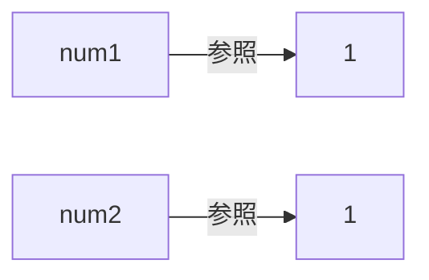
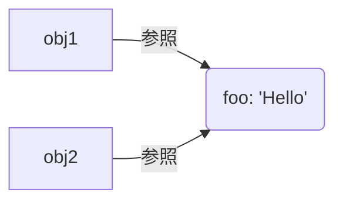
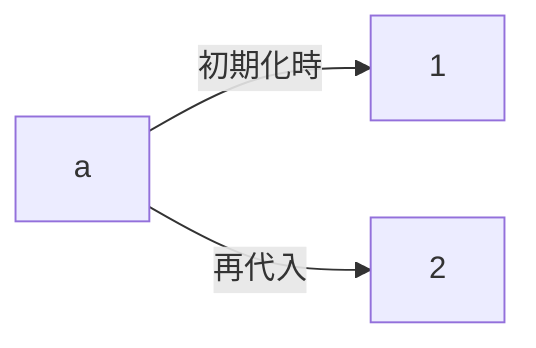

---
# try also 'default' to start simple
theme: seriph
# random image from a curated Unsplash collection by Anthony
# like them? see https://unsplash.com/collections/94734566/slidev
background: https://source.unsplash.com/collection/94734566/1920x1080
titleTemplate: "React研修資料 - ①"
exportFilename: "React研修資料 - ①"
# apply any windi css classes to the current slide
class: "text-center"
# https://sli.dev/custom/highlighters.html
highlighter: prism
# show line numbers in code blocks
lineNumbers: false
# persist drawings in exports and build
drawings:
  persist: true
# use UnoCSS
css: unocss
---

# React 研修資料 ①

<div class="pt-12">
  <span  class="px-2 py-1 rounded cursor-pointer" hover="bg-white bg-opacity-10">
    Press Space for next page <carbon:arrow-right class="inline"/>
  </span>
</div>

---

# React とは

<blockquote cite="https://ja.reactjs.org/">
  <p>「ユーザーインターフェースを構築するためのJavaScriptライブラリ」</p>
  <small><a href="https://ja.reactjs.org/">React公式ドキュメント</a>より引用</small>
</blockquote>

<br>
<div>
  Reactを使用するとSPA（シングルページアプリケーション）と言われる高速なアプリケーションが実現可能<br>

React と同じように SPA を構築できるフレームワークたち<br>

- Vue.js
- Angular
- Solid.js
- Preact
- Svelte

</div>

---

# React を学ぶ前に

<div>
Reactを学ぶ前に学ばなければいけないこと<br>

<strong class="text-xl">ES2015 以降の JavaScript</strong><br>
ex:

- アロー関数
- テンプレートリテラル
- 三項演算子
- 分割代入
- レストパラメーター
- スプレッド構文

などなど...

なのでまずは ES2015 以降の JavaScript について勉強します

</div>

---

# ES2015~のJavaScript

今後扱うテーマの目次

1. 式と文
1. 関数とアロー関数
1. テンプレートリテラル
1. 条件（三項）演算子
1. 分割代入
1. レストパターン
1. スプレッド構文
1. ミュータブルとイミュータブル
1. React でよく使うメソッド・記法
1. 非同期処理
1. ES Modules

---

# 1.1 式と文

JavaScript を構成する要素

<div>
  JavaScriptは式（expression）と文（statement）から構成されます。

- 式とは
  簡単に言うと、「値を生成し、変数に代入できるもの」<br>

  ex:<br>
  `1`や`foo`、`1 + 2`など

- 文とは
  簡単に言うと、「処理する 1 ステップで`;`で終わる処理」<br>

  ex:<br>
  `console.log('hello');`など

</div>

---

# 1.2 式と文の違い

<div>
  式と文の違いは<strong class="text-2xl mx-1">結果</strong>の有無で区別する → 式には結果があるが、文には結果がない

問題: 下記のコードではどれが「式」でしょうか<br>

```js
const greeting = "Hello, ";
const target = "world";
console.log(greeting + target);
```

</div>

---

# 1.2 問題の答え

<div>
  問題<br>

```js
const greeting = "Hello, ";
const target = "world";
console.log(greeting + target);
```

式

```js
"Hello, ", "world"; // 文字列リテラル
greeting, target; // 変数名
// ↓これも式
greeting + target; // 式 + 式 という形で、式ができている
```

文は直接的な結果を持たない。式を組み合わせて文を作ったり、文を組み合わせてより複雑な文を作る →if 文や while 文

```js
if (i < 10) {
	console.log("iは10未満です");
}
```

</div>

---

# 1.3 式文

<div>
式文とは、<strong class="text-xl">「式の後にセミコロンをつける式」</strong>のこと<br>

実はこれ、式文でした。

```js
console.log(greeting + target); // セミコロンついてる
```

上記の<code>console.log(greeting + target)</code>の部分が式。<br>
関数呼び出しが式なのは、一般に関数の返り値という結果を伴うから。<br>
ただし、上記のコードのようにすべての関数の実行が返り値を伴うわけではない。
<br>
<br>
<br>

これから先、何気なく関数呼び出しを書いて;で終わらせることがあると思いますが、実はそれが文の一種である式文を書いてるのだということを頭の片隅に置いておくといいことがあるかもしれませんよ。

</div>

---

# 2.1 関数とアロー関数

<div>
<p>普通の関数宣言</p>

```js
function foo(arg: argType): returnType {...}
```

<p>アロー関数</p>

```js
const foo = (arg: argType): returnType => {...}
```

<p>アロー関数と普通の関数の違い</p>

1. this のバインド
1. 宣言の巻き上げ（ホイスティング）

</div>

---

# 2.2 アロー関数の記法

<div>

1. 引数がない場合

   ```js
   () => {...}
   ```

1. 引数が 1 つの場合

   ```js
   arg: argType => {...} // () parenthesisを省略可
   ```

1. 引数が複数の場合

   ```js
   (arg1: arg1Type, arg2: arg2Type, arg3: argType3): returnType => {...}
   ```

1. 関数の本文（実行文）が 1 行の場合

   ```js
   (arg1: arg1Type, arg2: arg2Type): returnType => ... // return文を省略できて関数の本文がそのまま返り値になる
   ```

</div>

---

# 2.2 アロー関数の記法

5. 関数の本文（実行文）が複数行の場合

   ```js
   (arg1: arg1Type, arg2: arg2Type): returnType => {
     ...
     return 戻り値
   }
   ```

1. 関数の本文（実行文）が 1 行かつ戻り値がオブジェクトの場合

   ```js
   (arg1: arg1Type, arg2: arg2Type): returnType => ({...}) // () parenthesisで囲います
   ```

---

# 2.3 関数とアロー関数まとめ

<br>

- 使用するのはどちらでもいいが、プロジェクトを通して統一するべき
- コードを見てるとアロー関数で書いてることが肌感覚で多い気がする
- 公式ドキュメントとかは普通の関数宣言で書いてることが多い

---

# 3. テンプレートリテラル（文字列）

<div class="font-bold text-xl">
  テンプレートリテラルとは、文字列リテラルの中に定数や変数を挿入できる記法のこと
</div>

構文

```js
`${variable}`; // バッククオートで全体を囲んで、挿入したい変数や定数を${hoge}のように囲う
```

<br>
従来:
```js
const name = 'user1';
console.log('こんにちは,' + name + 'さん')
```
<br>
テンプレートリテラル:
```js
const name = 'user1';
console.log(`こんにちは、${name}さん`); // こんにちは、user1さん
```

---

# 4. 条件（三項）演算子

<div class="font-bold text-xl">
条件 (三項) 演算子は JavaScript では唯一の、3 つのオペランドをとる演算子
</div>

構文:<br>

```js
'条件式'?{'条件式がtruthyの時の式'}:{'条件式がfalsyの時の式'};
```

例：

```js
const thisIsTrue = true;
const name = thisIsTrue ? "me" : "you";
console.log(name); // meと表示される
```

<br>
<p class="font-bold text-xl">ポイント</p>
if文との違いは、式かどうか。<br>
その名の通り、演算子なので式を作る。<br>
Reactを書く中でも頻出なので頭の片隅に入れておくといいでしょう。

---

# 5.1 分割代入

分割代入（destructuring assignment）

<div>
例：
```js
const obj = { foo: 1, bar: 'hello' };
const { foo, bar } = obj; //これ
console.log(foo, bar) // 1, 'hello' と表示される
```
上記のコードの意味は<br>
「objのfooプロパティを変数fooに、objのbarプロパティを変数barに代入する」という意味<br>

従来の書き方でやると下記のようになる。

```js
const foo = obj.foo;
const bar = obj.bar;
```

分割代入の方がスッキリしてわかりやすくなってます。分割代入も React で頻出です。

</div>

---

# 5.2 分割代入

<div>
もし仮に代入する変数名を変更したい場合
```js
const obj = { foo: 1, bar: 'hello' };
const { foo: fooVar, bar } = obj; // ここ
console.log(fooVar, bar) // 1, 'hello'
```

`プロパティ名: 変数名` のように記述する

</div>

# 5.3 配列の分割代入

<div>
例:
```js
const arr =  [1, 3, 6, 10];
const [first, second, third]  = arr; // ここ
console.log(first, second, third); // 1, 3, 6
```
値をスキップする
```js
const arr =  [1, 3, 6, 10];
const [first, , third, fourth]  = arr; // 2番目をスキップ
console.log(first, third, fourth); // 1, 6, 10
```
</div>

---

# 6. レストパターン

<div>
オブジェクトの例：
```js
const obj = {
  foo: 123,
  bar: "string",
  baz: false
}
const { foo, ...restObj } = obj; // ここ
console.log(foo); // 123
console.log(restObj); // { bar: "string", baz: false }
```

配列にもレストパターンは使える<br>
配列の例：

```js
const arr = [1, 1, 2, 3, 5, 8, 13];
const [first, second, third, ...rest] = arr; // ここ
console.log(first); // 1
console.log(second); // 1
console.log(third); // 2
console.log(...rest); // [3, 5, 8, 13]
```

</div>

---

# 7. スプレッド構文

spread syntax

<div>
スプレッド構文は配列やオブジェクトをコピーして展開するときに役立つ

例：

```js
const obj1 = {
	bar: 456,
	baz: 789,
};
const obj2 = {
	foo: 123,
	...obj1, // ここ
};
console.log(obj2); // { foo: 123, bar: 456, baz: 789 }
```

上記において注意すべき点は「オブジェクトのコピー」だという点。<br>
展開元のオブジェクトのプロパティを変更してもコピー先のオブジェクトには影響しません。

</div>

---

# 7.x コラム

オブジェクトはいつ同じなのか

<div>
問題①：
```js
const num1 = 1;
const num2 = num1;
num2 = 10
console.log(num1);
```

問題 ②：

```js
const obj1 = { foo: "Hello" };
const obj2 = obj1;
obj2.foo = "Bye";
console.log(obj1);
```

上記のコードをそれぞれ実行した結果は？

</div>

---

# 7.x コラム

オブジェクトはいつ同じなのか

<div>
答え：<br>
①： <code>1</code><br>
②： <code>Bye</code>
</div>

解説：<br>
まずデータ型の話<br>

JavaScript においてはデータ型は大きく 2 つに分けられる<br>
① プリミティブ(値)型　(`Number`, `String`, `Boolean`, `Symbol`, `BigInt`, `Null`, `undefined`)<br>
② オブジェクト(参照)型　(`{}`, `[]`, `function(){}`など、プリミティブ型以外)<br>

### コピー時の挙動

① プリミティブ値のコピー => 参照先の<span class="text-purple-500">値</span>をコピーする<br>
② オブジェクトのコピー => オブジェクトへの<span class="text-purple-500">参照</span>をコピーする

---

# 7.x コラム

オブジェクトはいつ同じなのか

<div class="grid grid-cols-2 gap-10">
<div>
プリミティブ型の場合:<br>
```js
const num1 = 1;
const num2 = num1;
```


この時点で参照先はそれぞれ別に向いてる<br>=> <span class="text-purple-500">immutable</span>（片方の変数を変更してももう片方に影響を及ぼさない）

</div>
<div>
オブジェクト型（プリミティブ型以外）の場合:<br>
```js
const obj1 = { foo: 'Hello' };
const obj2 = obj1;
```


参照が同一（参照をコピーする）<br>=><span class="text-purple-500">mutable</span>（片方の変数を変更したらもう片方に影響を及ぼす）

つまり<span class="text-purple-600">「オブジェクトが同じ=参照が同じ」</span>ということになる

</div>
</div>

---

# 8.1 ミュータブルとイミュータブル

モダン FE をマスターするために

イミュータブルとは「既存のオブジェクトを破壊的に変更することを避けて、新しいデータを作る」手法。

イミュータブルではない（破壊的変更、ミュータブル）の例：

```js
let arr = [1, 3, 8, 10];
arr.push(100);
console.log(arr); // [1, 3, 8, 10, 100]
```

ここでの処理は一体何がいけないのでしょうか？

---

# 8.2 ミュータブルとイミュータブル

### プリミティブ型（immutable）のイメージ:<br>

<div class="grid grid-cols-2 items-center gap-5">
<div>
先ほどの処理

```js
let a = 1;
a = 2; // ここで新しい参照先を保持する
```

</div>



</div>

a に再代入する処理は、参照先が変わっており元の 1 とは違うとこに 2 がある

=> プリミティブ型（immutable）は特に何も考えずに再代入しても、ちゃんと差異を検知することができる。<br>
※「仮想 DOM」上で差異を検知してリアル DOM（仮想 DOM の対比）に反映する

これが React のレンダリングの仕組み

---

# 8.3 ミュータブルとイミュータブル

### プリミティブ型以外（mutable）のイメージ:<br>

<div class="grid grid-cols-2 items-center gap-5">

```js
let obj = { greeting: "Hello" };
obj.greeting = "Bye"; // 参照先は同じまま中身だけ変わる
```


</div>

obj の`greeting`プロパティの値を変えると、それは別のメモリを参照するのではなく、同一の参照を保持し続ける。

=> オブジェクトに破壊的変更を加えると、React がその差異を検知できない。<br>
（間違い探しの絵が 1 枚しかないような状況）

---

# 8.4 ミュータブルとイミュータブル

JavaScript,TypeScript における mutable/immutable

プリミティブ型 => immutable

プリミティブ型以外 => mutable

### Q. React で正しくオブジェクトの変更（差異）を検知してもらうためには？

<div class="mt-5">A.ミュータブルであるオブジェクトを<span class="text-purple-500 ">イミュータブルに</span>扱わなければならない。</div>

例：

```js
const obj1 = { greeting: "Hello" };
const obj2 = { ...obj1 }; // スプレッド構文でオブジェクトをコピーしてる　=　イミュータブル
obj2.greet = "bye";
console.log(obj2); // { greeting: 'bye' } 元のobj1は変わってない
```

<br>
この辺も詳しくは本格的にReactを扱うときにやります。

---

# 9.1 React でよく使用するメソッド・記法

1. map, filter などの配列ループ系

   ```js
   const arr = [1, 3, 5, 7];
   const doubleArr = arr.map((num: number) => num * 2); // arrの配列を2倍する処理
   console.log(doubleArr); // [2, 6, 10, 14]
   ```

1. Optional chaining 演算子

   ```js
   const obj1 = {
   	name: "taro",
   	hello: () => "Hello",
   };
   console.log(obj1?.name); // nameプロパティがなかったらundefinedが返る
   console.log(obj1.bye?.()); // byeメソッドはないのでundefinedになるがランタイムエラーは発生しない
   ```

---

# 9.2 React でよく使用するメソッド・記法

3. 短絡評価（ショートサーキット評価）

   ```js
   const greet = '' || undefined || null || 0 || NaN || 'Hello';
   const name = '' && 100 && [] && () && 'Taro';
   true && console.log(greet); //  'Hello'
   false && console.log(greet); // no output
   true || console.log(name) // no output
   false || console.log(name) // 'Taro'
   ```

4. Null 合体演算子（Nullish Coalescing）
   ```js
   const arr = ["dog", "cat", null, ""];
   const animals = arr.map((animal) => animal ?? "not animal");
   console.log(animals); // ["dog", "cat", "not animal", ""]
   ```

---

# 10.1 非同期処理

JavaScript の大きな壁

問題：このコードはどういう順番で実行されるでしょう？

```js
console.log(1);
setTimeout(() => console.log(2), 3000);
console.log(4);
setTimeout(() => console.log(3), 1000);
```

1. `1, 2, 3, 4`
2. `1, 4, 3, 2`
3. `1, 4, 2, 3`
4. エラーが起きる

---

# 10.2 非同期処理

JavaScript の大きな壁

正解： `1, 4, 2, 3`

答えが合ってた人はかなり JavaScript の知識が深い方だと思います。

非同期処理を扱うと時間が全然足りなくなると思うので、非同期処理の詳細も別講座に譲ります。

---

# 11.1 ES Modules

JavaScript のモジュールシステム

<div>
  JavaScriptのモジュールシステムを使用すれば、他のモジュールで定義した変数や関数を、インポートして使うことができます。

変数の例：

<div class="grid grid-cols-2 gap-5">
  <div>

```js
// index.js
import { name, age } from "~/module.js";
console.log(name, age); // Kenya, 24
```

  </div>
  <div>

```js
// module.js
export const name = "Kenya";
export const age = 24;
```

  </div>
</div>

関数の例：

<div class="grid grid-cols-2 gap-5">
  <div>

```js
// index.js
import { greet } from "~/module.js";
const helloTaro = greet("Taro");
console.log(helloTaro); // こんにちは、Taroさん
```

  </div>
  <div>

```js
// module.js
export const greet = (name) => {
	return `こんにちは、${name}さん`;
};
```

  </div>
</div>

</div>

---

# 11.2 ES Modules

ES Modules のメリット

1. ファイル分割

   複数ファイルにコードスプリットできるので、処理ごとにファイルを分割できる=><span class="text-purple-400">保守性や可読性の向上</span>

2. カプセル化

   モジュール内で定義された変数はそのモジュール内をスコープとして持ち、エクスポートされない限り他のモジュールからは参照できません。これにより、モジュールの機能の内部実装を外部から隠蔽することができます。

---

# 11.3 ES Modules

export/import の種類

export/import は大きく 2 種類あります

1.  `default export/import`

例：

 <div class="grid grid-cols-2 gap-5">
<div>

```js
// export文 => export default 式;
✅ export default 24;
✅ export default function name(){};
✅ export { age as default };

//下記はダメ
❌ export default const age;
❌ export default const name = () => {};
```

</div>

<div>

```js
//構文 => import A from "~/module.js";
✅ import age from "~/module.js";

// こんなのもOK
✅ import age as yearsOld from "~/module.js";
✅ import { default as yearsOld } from "~/module.js";
```

</div>

</div>

---

# 11.3 ES Modules

export/import の種類

2. `named export/import`

例：

 <div class="grid grid-cols-2 gap-5">
<div>

```js
// export文
✅ export const age = 24;
✅ export function name(){};
✅ export const name = () => {};
✅ export { age, name };
```

</div>

<div>

```js
//構文 => import { A } from "~/module.js";
✅ import { age } from "~/module.js";
✅ import { age, name } from "~/module.js";
✅ import { age as yearsOld} from "~/module.js";
```

</div>

</div>

---

# 11.4 ES Modules

default export と named export の違い

1. 呼び出す側のインターフェース

named export は`as`を使用しない限り定義元の名前を変更することはできないが、`default export`は`as`を使用せずに自由な命名で呼び出せる。

`default export/import`の例：

<div class="grid grid-cols-2 gap-5">
  <div>

```js
// index.js
import age from "~/module.js";
console.log(`Kenyaは${age}歳です`); // Kenyaは24歳です。

// これでもOK
import yearsOld from "~/module.js";
console.log(`Kenyaは${yearsOld}歳です`);
```

  </div>
  <div>

```js
// module.js
export default 24;
```

  </div>
</div>

---

# 11.4 ES Modules

default export と named export の違い

2. 1 ファイルから export できる数

named export は 1 つのファイルから複数の変数や関数をエクスポートできるが、default export は 1 つのファイルにつき、1 つの変数や関数しかエクスポートできない。

例：

<div class="grid grid-cols-2 gap-5">
<div>

```js
// named export の場合
✅  export const name = "Kenya";
✅  export const age = 24;
```

</div>
<div>

```js
// default export の場合
✅  export default "Kenya";
❌  export default = 24;
```

</div>

</div>

---

# 11.5 ES Modules

default export と named export どちらを使うべき？

結論、基本的に named export を使用していれば大丈夫です。主な理由としてはエディタサポートの弱さです。<br>

named export の場合、export した時点で変数や関数の名前が明示的に決まっています。そのため、呼び出す側で`import`文を書かずに変数や関数名を記述するだけで勝手に import をする、入力補完が効きます。<br>
しかし、default export の場合は、変数や関数を定義した時点で、それらに名前はついていません（暗黙的に default という変数名で export している、と説明した方が正確かもしれません）。<br>
export した変数名に固有の名前がついていないのですから、エディタはどの変数を import すればいいのかを判断できませんね。<br>

こうした理由から default export はエディタのサポートが弱くなるので基本的に named export を使いましょう。(ただし、default export しか使用できない場面もあります)

---

# 力試し ①

### 下記の問題に回答してみましょう。

<div class="grid grid-cols-2 gap-x-3 mt-5">

1. 「式」と「文」の違いを答えてみましょう。
<details>
<summary>回答例</summary>
<code>式はそれ自体が結果を持つが、文は結果を持たない。</code>
</details>

<div>

2. 次の関数をアロー関数で書き換えてみましょう。

```js
function hoge(num1, num2) {
	return num1 + num2;
}
```

</div>

<details>
<summary>回答例</summary>

```js
const hoge = (num1, num2) => num1 + num2;
```

</details>

<div>

3. 次のコードを条件（三項）演算子で書き換えてみましょう。

```js
if (true) {
	const foo = "bar";
} else {
	const foo = "baz";
}
```

</div>

<details>
<summary>回答例</summary>

```js
const foo = true ? "bar" : "baz";
```

</details>

</div>

---

# 力試し ②

<div class="grid grid-cols-2 gap-x-3">
<div>

4. 下記のオブジェクトを分割代入で取得してみましょう

```js
const obj = { name: "foo", age: 20 };
```

</div>

<details>
<summary>回答例</summary>

```js
// ログを出して確認してみよう！
const { name, age } = obj;
```

</details>

<div>

5. 次の 2 つの配列を結合させた新しい配列を作ってみましょう。

```js
const arr1 = [1, 2, 3];
const arr2 = [4, 5, 6];
```

</div>

<details>
<summary>回答例</summary>

```js
const newArr = [...arr1, ...arr2];
```

</details>

<div>

6. 各 User の FirstName と LastName を結合させた新しい配列を作ってみましょう。

```js
const users = [
	{ firstName: "Betty", lastName: "Sawayn" },
	{ firstName: "Kale", lastName: "Ledner" },
	{ firstName: "Randall", lastName: "Robel" },
];
```

</div>

<details>
<summary>回答例</summary>

```ts
const newUsers = users.map(({ firstName, lastName }) => ({
	fullName: `${firstName} ${lastName}`,
}));
```

</details>

</div>

---

# Learn More

[MDN](https://developer.mozilla.org/ja/docs/Web/JavaScript) · [JavaScript Primer](https://jsprimer.net/)
